# LearnHub

## Architecture

This project consists of two main components:

- **Client**: React Router v7 application with TypeScript and Tailwind CSS
- **Server**: Express.js API server with TypeScript and Firebase integration

## Tech Stack

### Frontend

- React 19 with React Router v7
- TypeScript
- Tailwind CSS v4
- ShadCN UI components
- TanStack Query for data fetching
- Socket.IO client for real-time features
- React Hook Form with Zod validation

### Backend

- Node.js with Express.js
- TypeScript
- Firebase Admin SDK
- Socket.IO for real-time communication
- JWT authentication
- Nodemailer for email services
- Inversify for dependency injection

## Screenshots

### Authentication & Common Features

#### Login Page

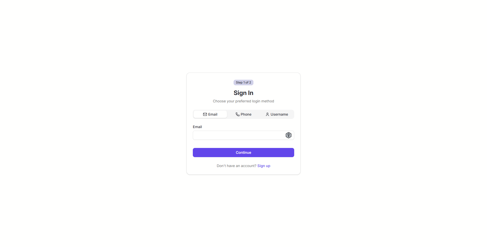

#### Real-time Chat

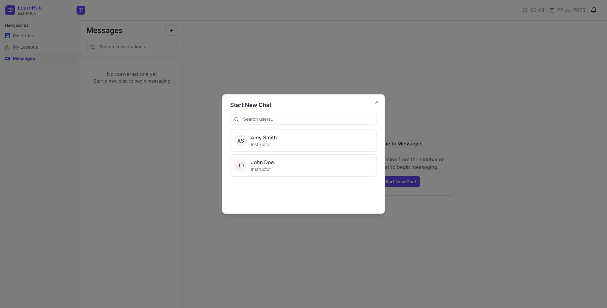
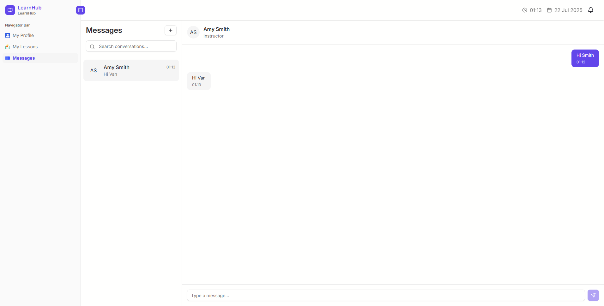

### Instructor Features

#### Student Management

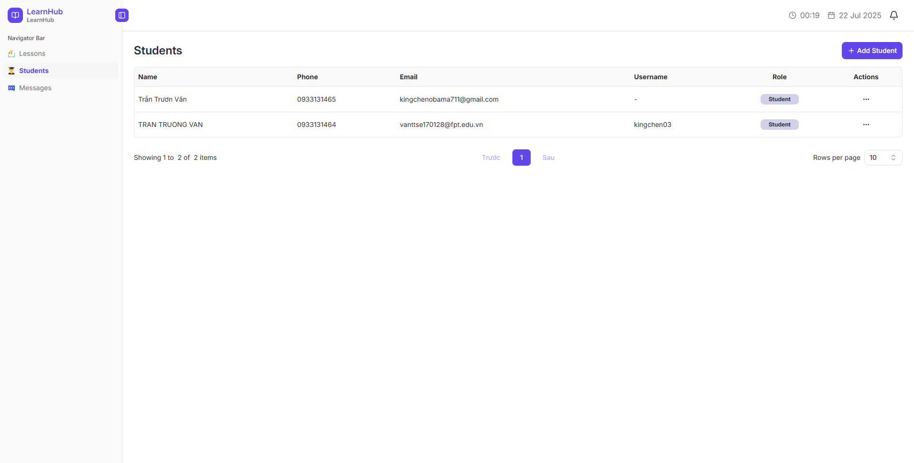
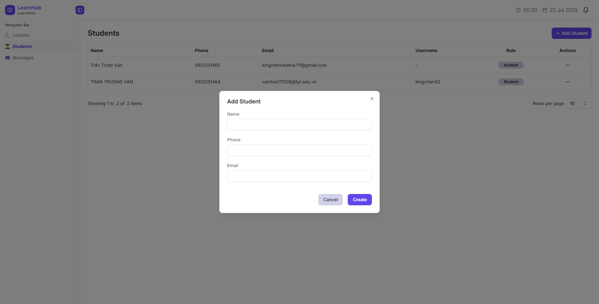
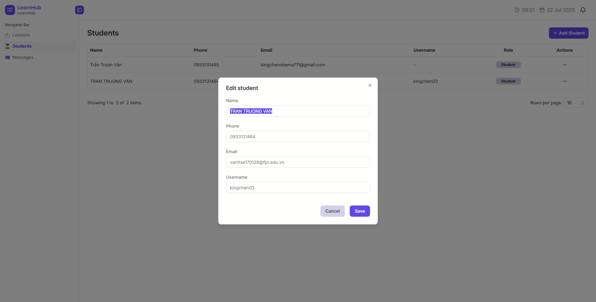

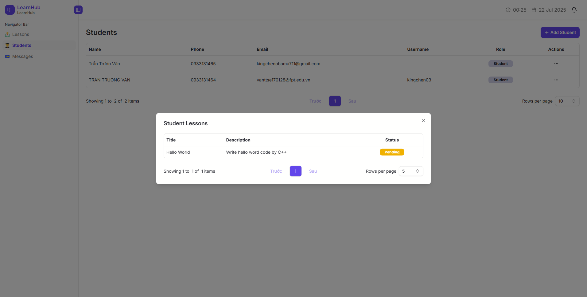
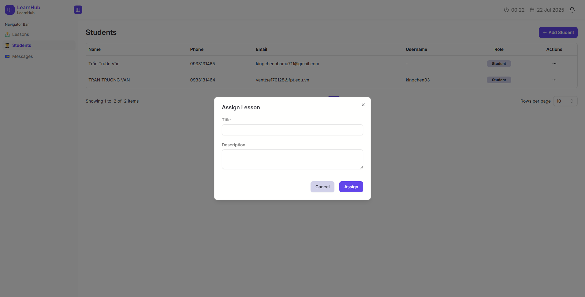

#### Lesson Management

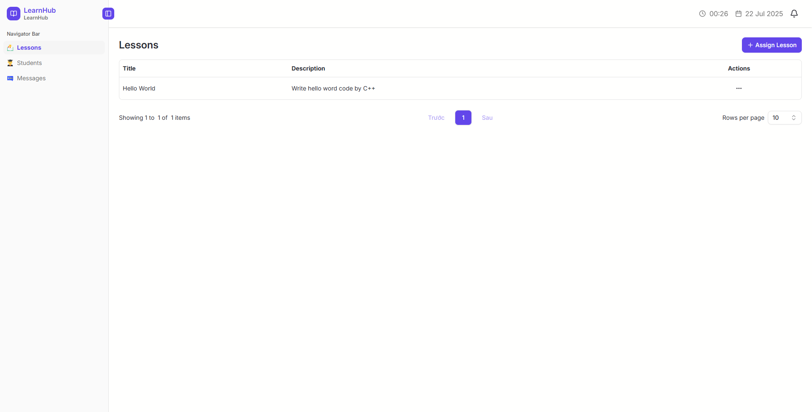
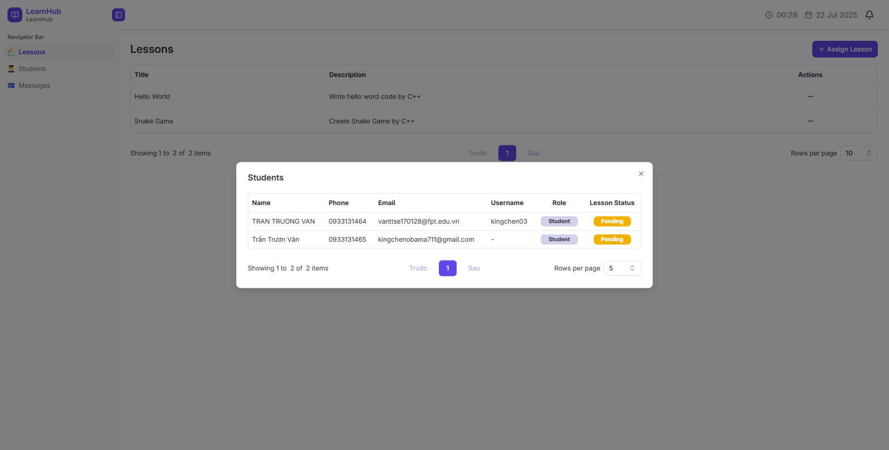
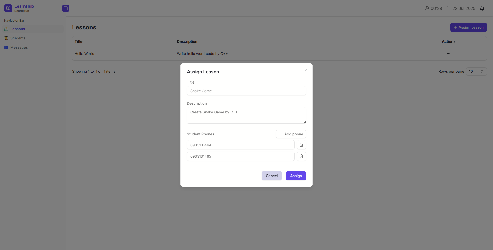

### Student Features

#### Account Setup

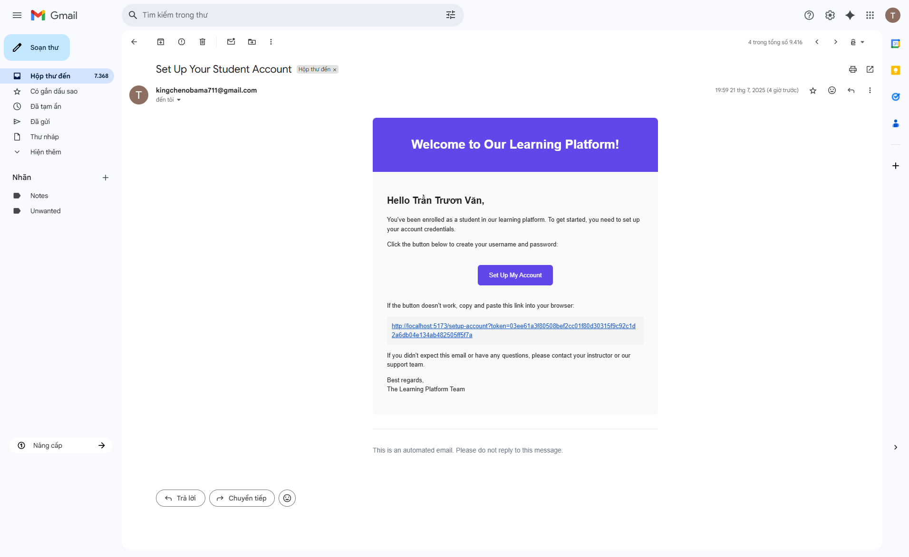
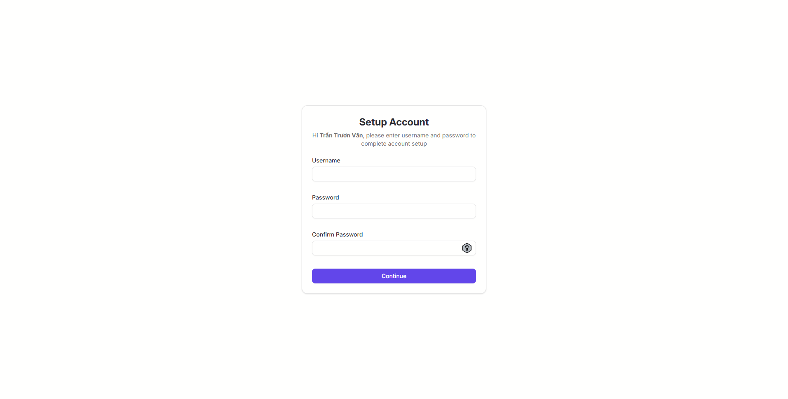

#### My Profile

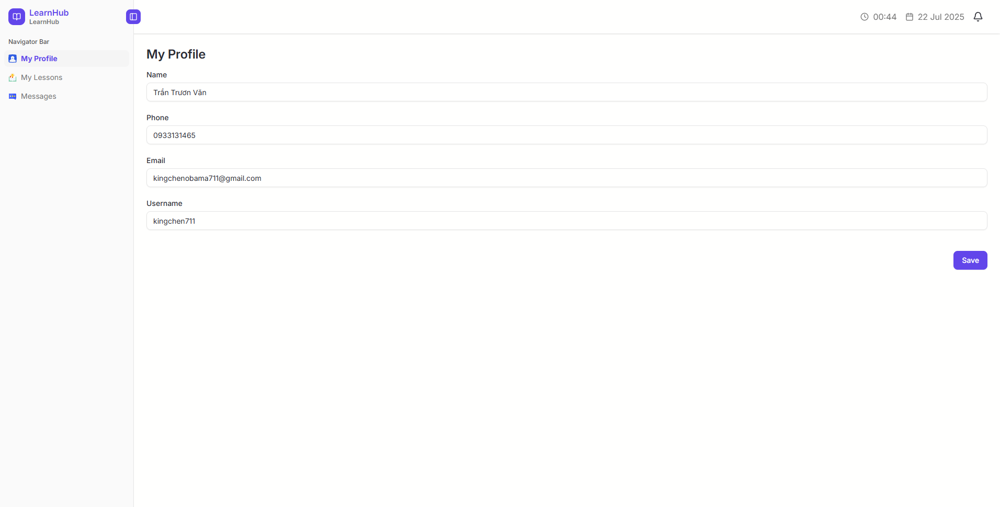

#### My Lessons

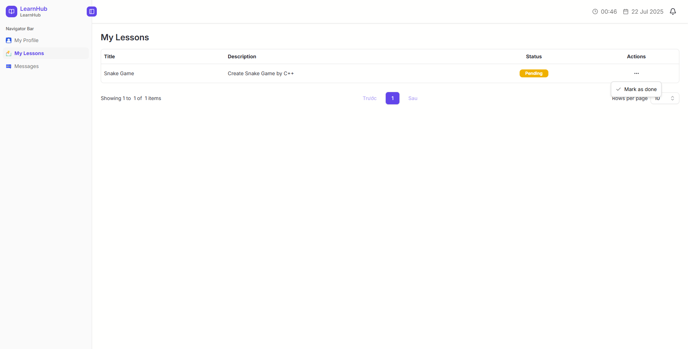

## Getting Started

### Prerequisites

- Node.js
- npm
- Firebase project (for database)

### Installation

1. Clone the repository:

```bash
git clone https://github.com/KingChen711/Skipli-ChallengeV6-
```

2. Install dependencies for both client and server:

```bash
# Install client dependencies
cd client
npm install

# Install server dependencies
cd ../server
npm install
```

### Configuration

#### Server Configuration

1. Copy the environment example file:

```bash
cd server
cp .env.example .env
```

2. Update the `.env` file with your configuration:

```env
PORT=5000
ALLOWED_ORIGINS=http://localhost:5173

AWS_ACCESS_KEY=
AWS_SECRET_KEY=
AWS_REGION=

JWT_SECRET=
JWT_EXPIRES_IN=

NODEMAILER_HOST=smtp.gmail.com
NODEMAILER_PORT=587
NODEMAILER_USER=
NODEMAILER_PASSWORD=

FRONTEND_URL=http://localhost:5173
```

3. Add your `firebase.key.json` to server folder

4. Seed data

```bash
npm run seed
```

#### Client Configuration

The client is configured to connect to the server at `http://localhost:5000` by default. Update `client/.env` if needed:

```env
VITE_PUBLIC_API_ENDPOINT=http://localhost:5000
```

### Development

Start both the client and server in development mode:

```bash
# Terminal 1 - Start the server
cd server
npm run dev

# Terminal 2 - Start the client
cd client
npm run dev
```

The client will be available at `http://localhost:5173` and the server at `http://localhost:5000`.

### Building for Production

#### Client

```bash
cd client
npm run build
npm run start
```

#### Server

```bash
cd server
npm run build
npm run start
```

## Scripts

### Client Scripts

- `npm run dev` - Start development server
- `npm run build` - Build for production
- `npm run start:csr` - Start production server
- `npm run lint` - Run ESLint
- `npm run prettier` - Check code formatting

### Server Scripts

- `npm run dev` - Start development server with nodemon
- `npm run build` - Build TypeScript to JavaScript
- `npm run start` - Start production server
- `npm run seed` - Run database seeding
- `npm run lint` - Run ESLint
- `npm run prettier` - Check code formatting

## Project Structure

```
LearnHub/
├── client/                          # React Router v7 Frontend Application
│   ├── app/                         # Application source code
│   │   ├── assets/                  # Static assets (images, icons)
│   │   ├── components/              # Reusable UI components
│   │   │   └── ui/                  # ShadCN UI components
│   │   ├── contexts/                # React context providers
│   │   │   ├── auth-provider.tsx    # Authentication context
│   │   │   ├── react-query-provider.tsx # TanStack Query setup
│   │   │   └── socket-provider.tsx  # Socket.IO context
│   │   ├── hooks/                   # Custom React hooks
│   │   │   ├── auth/                # Authentication hooks
│   │   │   ├── lessons/             # Lesson management hooks
│   │   │   ├── messages/            # Chat/messaging hooks
│   │   │   ├── students/            # Student management hooks
│   │   │   └── use-mobile.ts        # Mobile detection hook
│   │   ├── lib/                     # Utility libraries
│   │   │   ├── schema/              # Zod validation schemas
│   │   │   ├── http.ts              # HTTP client configuration
│   │   │   └── utils.ts             # Utility functions
│   │   ├── routes/                  # React Router v7 routes
│   │   │   ├── (auth)/              # Authentication routes (login, register)
│   │   │   └── (protected)/         # Protected routes (dashboard, profile)
│   │   ├── types/                   # TypeScript type definitions
│   │   │   ├── index.ts             # General types
│   │   │   └── models.ts            # Data model types
│   │   ├── app.css                  # Global styles
│   │   ├── root.tsx                 # Root component
│   │   └── routes.ts                # Route configuration
│   ├── public/                      # Static public assets
│   ├── .env                         # Environment variables
│   ├── .env.example                 # Environment template
│   ├── Dockerfile                   # Docker configuration
│   ├── package.json                 # Dependencies and scripts
│   ├── tsconfig.json                # TypeScript configuration
│   └── vite.config.ts               # Vite build configuration
│
├── server/                          # Express.js Backend API
│   ├── src/                         # Source code
│   │   ├── config/                  # Configuration files
│   │   │   ├── firebase.config.ts   # Firebase Admin SDK setup
│   │   │   └── inversify.config.ts  # Dependency injection container
│   │   ├── helpers/                 # Utility helpers
│   │   │   ├── errors/              # Error handling utilities
│   │   │   ├── api-error.ts         # Custom API error classes
│   │   │   ├── paged-list.ts        # Pagination helper
│   │   │   ├── utils.ts             # General utilities
│   │   │   └── validation.ts        # Input validation helpers
│   │   ├── middleware/              # Express middleware
│   │   │   ├── authorize.middleware.ts      # JWT authentication
│   │   │   ├── cors.middleware.ts           # CORS configuration
│   │   │   ├── error-handling.middleware.ts # Global error handler
│   │   │   ├── socket.middleware.ts         # Socket.IO middleware
│   │   │   └── validate-request-data.middleware.ts # Request validation
│   │   ├── modules/                 # Feature modules
│   │   │   ├── auth/                # Authentication (login, register, JWT)
│   │   │   ├── chat/                # Real-time messaging
│   │   │   ├── email/               # Email notifications (Nodemailer)
│   │   │   ├── firebase/            # Firebase integration
│   │   │   ├── lessons/             # Lesson management
│   │   │   └── users/               # User management (students, instructors)
│   │   ├── scripts/                 # Database seeding scripts
│   │   │   └── seed.ts              # Initial data seeding
│   │   ├── types/                   # TypeScript definitions
│   │   │   ├── enum.ts              # Enumerations
│   │   │   └── models.ts            # Data model interfaces
│   │   ├── index.ts                 # Application entry point
│   │   └── type.d.ts                # Global type declarations
│   ├── dist/                        # Compiled JavaScript (generated)
│   ├── public/                      # Static files served by Express
│   ├── .env                         # Environment variables
│   ├── .env.example                 # Environment template
│   ├── firebase.key.json            # Firebase service account key
│   ├── package.json                 # Dependencies and scripts
│   └── tsconfig.json                # TypeScript configuration
│
├── screenshots/                     # Application screenshots
│   ├── common/                      # Shared features (login, chat)
│   ├── instructors-features/        # Instructor-specific screenshots
│   └── students-features/           # Student-specific screenshots
│
└── README.md                        # Project documentation
```

### Key Architecture Patterns

#### Frontend (Client)

- **Route-based Code Splitting**: Routes are organized in `(auth)` and `(protected)` groups
- **Context Providers**: Centralized state management for auth, queries, and socket connections
- **Custom Hooks**: Feature-specific hooks for data fetching and state management
- **Component Library**: ShadCN UI components for consistent design
- **Type Safety**: Full TypeScript integration with Zod schema validation

#### Backend (Server)

- **Modular Architecture**: Features organized into separate modules (auth, chat, lessons, users)
- **Dependency Injection**: Inversify container for loose coupling and testability
- **Middleware Pipeline**: Layered middleware for authentication, validation, and error handling
- **Real-time Communication**: Socket.IO integration for live chat and notifications
- **Database Integration**: Firebase Firestore for data persistence
- **Email Services**: Nodemailer integration for notifications

#### Shared Patterns

- **TypeScript First**: Full type safety across both client and server
- **Environment Configuration**: Separate environment files for different deployment stages
- **Code Quality**: ESLint and Prettier for consistent code formatting
